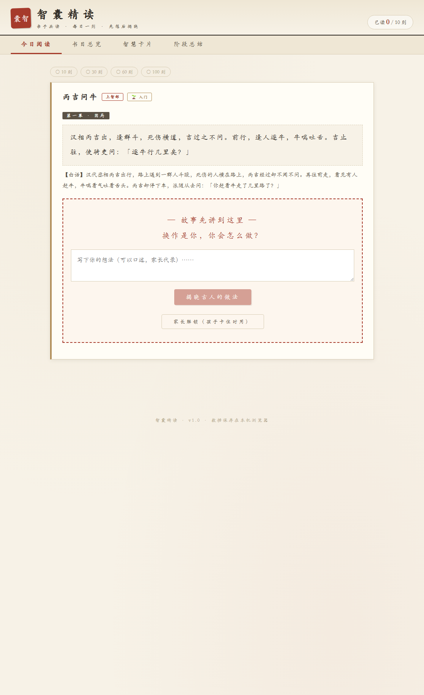
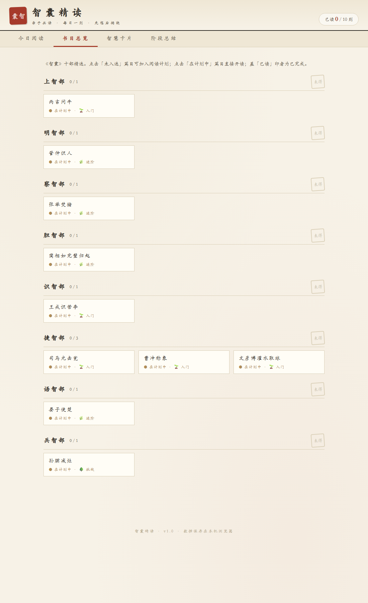
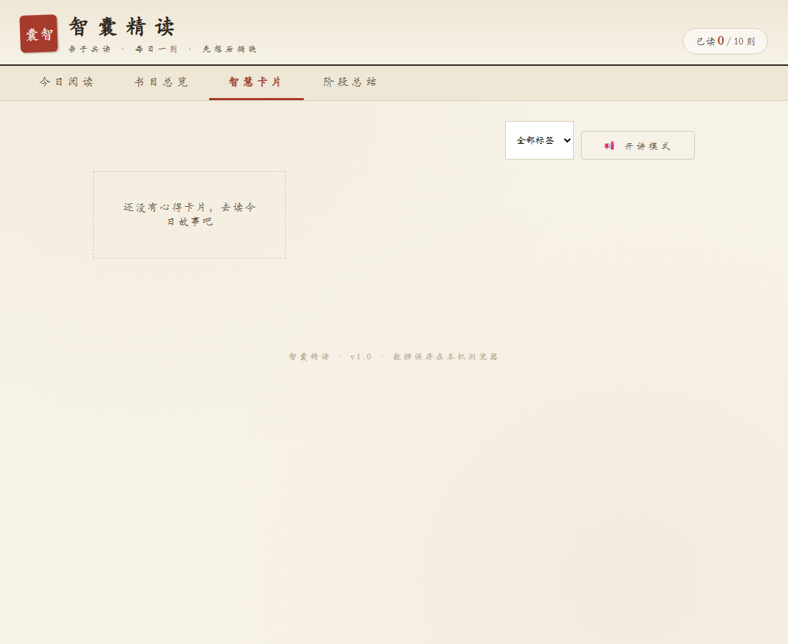

# 智囊精读 · 亲子共读《智囊》

> 每日一则，先想后揭晓。和五年级的孩子一起，用一学期读完 120 则古人智慧。

[](https://yome88.github.io/zhinang-jingdu/)
[](manifest.json)
[](智囊精读App.html)

## 这是什么

一个**纯本地运行**的亲子精读 App：家长做引导者，孩子做主角，对冯梦龙《智囊》进行有计划、有节奏、有沉淀的精读。无需账号、无需后端、零依赖，打开浏览器就能用；也可打包为安卓 App 全屏离线使用。

设计的初心是四件事：

1. **持续** —— 每天一则的节奏可追踪、有激励，降低断更概率
2. **深思** —— 「先想后揭晓」两幕式交互，确保孩子先独立思考，再对照古人智慧
3. **沉淀** —— 每则的心得以孩子为主完整留痕，学期末可导出、可打印成册
4. **启发现实** —— 每则配现实话题引子，把古典智慧连接到校园、家庭、网络与时事

## 界面一览

| 今日阅读（两幕式精读） | 书目总览（进度可视） |
|---|---|
|  |  |

| 智慧卡片（孩子的心得） | 阶段总结 |
|---|---|
|  |  |

## 核心玩法：两幕式精读

每则故事讲一半就停在最纠结的地方——

- **第一幕**：原文 + 白话，停在悬念处。先问孩子：「换作是你，你会怎么做？」把想法写下来（可口述、家长代录）。
- **揭晓**：点「揭晓古人的做法」后才展示第二幕结局、冯梦龙按语和现实话题引子——答案不提前泄露，讨论才有真碰撞。

## 功能特性

- 📖 **120 则精选篇目**：从《智囊》全书一千多则中选出适合儿童的篇目，按原书十部组织（上智 / 明智 / 察智 / 胆智 / 术智 / 捷智 / 语智 / 兵智 / 闺智 / 杂智）
- 🌱 **三级难度 + 螺旋编排**：入门 → 进阶 → 挑战，每周轮换主题避免连读疲劳
- 🗂 **书目总览**：十部篇目哪些已选、哪些已完成，一目了然
- 💭 **心得留痕**：以孩子的回答与感悟为主，形成「智慧卡片」集
- 🏅 **激励设计**：累计成就（印章、里程碑），只做正向激励，不做断签惩罚
- 📊 **阶段总结**：按阶段回顾阅读轨迹与心得精华，支持导出 JSON 备份与打印成册
- 📱 **移动端优化**：≤640px 自适应布局，触达尺寸、双列书目均按手机调校
- 🎨 **古典书卷风**：宣纸底色、印章元素，读古书要有读古书的样子

## 使用方式

### ① 网页版（最快）

直接打开：**https://yome88.github.io/zhinang-jingdu/**

或本地使用：下载本仓库后双击 `智囊精读App.html` 即可，无需安装任何东西。

### ② 安装为安卓 App（TWA，推荐）

本项目已通过 [PWABuilder](https://www.pwabuilder.com/) 打包为 TWA（Trusted Web Activity）：

- 包名 `io.github.yome88.twa`，全屏无浏览器地址栏，离线可用
- 数字资产链接（Digital Asset Links）已部署于 `yome88.github.io/.well-known/assetlinks.json`（见 [yome88.github.io](https://github.com/yome88/yome88.github.io) 仓库）

安装步骤：把签名后的 `智囊精读.apk` 传到安卓手机（微信文件传输助手 / 数据线均可）→ 点击安装并允许「未知来源」→ 打开即用。

### ③ 苹果设备

iPhone / iPad 上用 Safari 打开网页版 → 分享 → 「添加到主屏幕」，即可获得接近原生 App 的全屏体验。

## 数据与隐私

- 所有数据（进度、心得、激励）仅保存在**本机浏览器 localStorage**（键名 `zhinang-jingdu-v1`），不上传任何服务器
- 换设备前请先在「阶段总结」页导出 JSON 备份；各设备间数据不互通
- 清除浏览器数据会清空学习记录，请定期导出

## 技术栈与目录

零依赖单文件应用：原生 HTML + CSS + JavaScript，无框架、无构建步骤。

```
├── 智囊精读App.html   # 应用本体（UI + 120 则内容 + 全部逻辑）
├── index.html         # Pages 入口（重定向 + 注册 Service Worker）
├── manifest.json      # PWA 清单
├── sw.js              # Service Worker（cache-first 离线缓存）
├── icons/             # 印章风应用图标
├── tests/
│   ├── test.js        # Node 沙箱断言测试（2000+ 项）
│   └── seeded.html    # 种子数据端到端测试副本
├── docs/screenshots/  # README 配图
└── PRD-智囊亲子精读App.md  # 产品需求文档
```

运行测试：

```bash
node tests/test.js
```

## 写在最后

《智囊》不是教计谋的书，是教「遇事怎么办」的书。希望孩子读完这一百二十则之后，遇到难题时心里能多几盏灯。

祝共读愉快。
